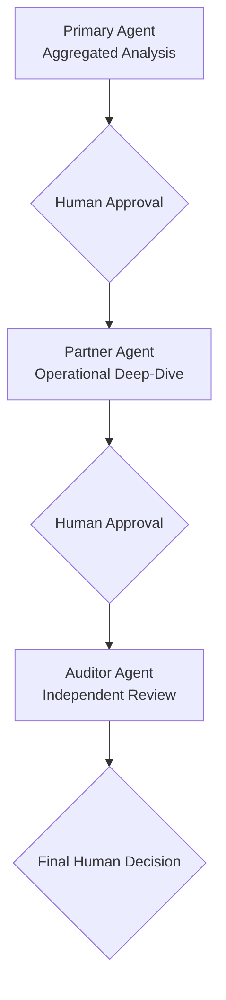

# Architecture Analysis — Agentic Solution for Product Decision Support

> **Author:** Vicente Maciel Junior — vicentem@microsoft.com — Cloud & AI Solutions Architect

## Overview

This repository contains the **architecture analysis** of an AI agent-based solution designed to **support product team decision-making** in the beverage (consumer products) industry.
This is a sample use case to demonstrate MAF (Microsoft Agent Framework 1.0) and the **A2A (Agent-to-Agent) protocol** for direct inter-agent communication over HTTP. For a comparison between the A2A approach and the previous Azure Service Bus approach, see [`sample/COMPARISON-SB-VS-A2A.md`](sample/COMPARISON-SB-VS-A2A.md).

> **Disclaimer**: This sample is based on a **fictional beverage company**. All company names, brand names (Velvet Ember, Midnight Drift, Silver Mist, Golden Breeze, Coral Bloom), regions, territories, and data used throughout the demo are entirely fictional and do not represent any real company or product.

The solution is **analytical and advisory** — it does not execute operational actions. Its goal is to provide explainable and traceable analyses that assist humans in making decisions about territories, brands, and product packages.

## Core Principles

- **Explainability**: every AI-generated output must be justifiable and traceable.
- **Human-in-the-loop**: humans approve each transition between analytical stages.
- **Data governance**: strict control over data access and usage.
- **Enterprise security**: adherence to corporate security standards.

## Agent Architecture

The solution is composed of **3 agent types**:

### Primary Agent

- Performs **aggregated analyses** on enterprise data from the main organization.
- Identifies **high-impact territories** across brands and product packages.
- Produces explanatory analyses that direct the focus of the Partner Agent.

### Partner Agent

- Performs **operational deep-dives** on partner data, with focus defined by the Primary Agent.
- Identifies **consumption clusters**.
- Each partner is an **independent company** with its own infrastructure and IT staff.
- There is **one specialized agent per partner**, implying a distributed topology.

### Auditor Agent

- Performs **independent review and quality control** over the outputs of the Primary and Partner agents.
- Verifies **analytical consistency**, identifying inconsistencies or failures.
- Acts as an internal validation layer before the final human decision.

## Analytical Flow

## Solution Constraints

- **Analysis only** — no operational actions are executed.
- **Mandatory human approval** between each analytical stage.
- **All outputs are explainable and traceable**.

## Observability

### Must Include

- Logging of user actions (event-level only, no content).
- Logging of agent execution flows and execution identifiers.
- Logging of errors, failures, and timeouts.
- Logging of content moderation and scope-control events.
- System version and technical metadata.
- Basic monitoring: agent availability, execution success rate, recurrent failures, and data source availability.

### Must Not Include (for the Demo)

- No logging of user prompts or AI-generated content.
- No advanced enterprise observability tooling (unless explicitly proposed).
- No real-time review of individual interactions.

## Proposed Architecture

> See the full diagram: [architecture/high-level-architecture.drawio](architecture/high-level-architecture.drawio)

### Technology Stack

| Layer | Azure Service | Purpose |
|---|---|---|
| **Presentation** | Azure Static Web App | Product team interface and human approval UI |
| **API Gateway** | Azure API Management | Single entry point, authentication enforcement, rate limiting |
| **Orchestration** | Python app (FastAPI + uvicorn) + Microsoft Agent Framework (MAF) | Workflow engine managing agent sequencing and HITL checkpoints |
| **Agent Communication** | A2A (Agent-to-Agent) protocol over HTTP | Direct inter-agent communication using open standard Agent Cards and JSON-RPC |
| **State Management** | Azure Cosmos DB | Workflow state and approval status persistence |
| **AI Agents** | Azure AI Foundry | Primary Agent and Auditor Agent hosted centrally |
| **Partner Agents** | Partner-owned infrastructure | One agent per partner, deployed in their own environment |
| **Enterprise Data** | Azure SQL Database | Organization's analytical data |
| **Output Storage** | Azure Storage Accounts | Persisted analysis outputs and audit trail |
| **Identity** | Microsoft Entra ID + Managed Identities | Authentication and authorization |
| **Secrets** | Azure Key Vault | Credentials and configuration secrets |
| **Monitoring** | Azure Monitor + Application Insights + Log Analytics | Event-level logging only (no content captured) |

### Orchestration with Microsoft Agent Framework (MAF)

MAF serves as the core multi-agent orchestrator, running as a Python application. It defines how agents are invoked, how they communicate, and how the workflow progresses through HITL (Human-in-the-Loop) checkpoints.

The orchestration flow:

1. **MAF Orchestrator invokes the Primary Agent** (direct call via MAF SDK) — the agent reads enterprise data and produces an aggregated analysis.
2. **Workflow pauses** — state is persisted to Cosmos DB and the Product Team is notified for approval.
3. **On human approval**, the orchestrator **resolves the Partner Agent’s A2A Agent Card** and calls the agent directly via the A2A protocol over HTTP.
4. **Partner Agent(s) execute locally** in their own infrastructure, reading partner data and producing results. Results are returned via the A2A response protocol.
5. **Workflow pauses again** for a second human approval.
6. **On approval**, the orchestrator **invokes the Auditor Agent** (direct call via MAF SDK) for independent review.
7. **Final output is delivered** to the Product Team for decision.

### Cross-Boundary Communication with Partners

Partner Agents live in **completely separate infrastructure** owned by independent companies. The architecture uses the **A2A (Agent-to-Agent) protocol** for cross-boundary communication:

- Each Partner Agent **hosts an A2A HTTP endpoint** that publishes an Agent Card describing its capabilities, skills, and supported interaction modes.
- The MAF Orchestrator **discovers Partner Agents** by resolving their Agent Cards at `/.well-known/agent.json`.
- Requests and responses flow via **A2A JSON-RPC** over HTTP — direct, synchronous, and contract-driven.
- Partners are **not required to use MAF** — they only need to implement the open A2A protocol specification.

This pattern ensures **technology agnosticism** (any framework that speaks A2A can participate), **self-description** (Agent Cards enable automated discovery), and **simplicity** (no middleware infrastructure required). For scenarios requiring **durable messaging** (offline partners, guaranteed delivery), Azure Service Bus can be layered as a transport — see [COMPARISON-SB-VS-A2A.md](sample/COMPARISON-SB-VS-A2A.md).

### Key Architectural Decisions

1. **A2A protocol for partner communication** — open standard enabling direct HTTP-based agent-to-agent calls with built-in service discovery (Agent Cards), eliminating the need for middleware infrastructure. Partners expose A2A endpoints and the orchestrator discovers and calls them directly.
2. **Cosmos DB for workflow state** — enables HITL checkpoints to persist state across human review sessions that may take hours or days.
3. **Auditor Agent independence** — the Auditor Agent runs with a separate context and model configuration to ensure it is not influenced by the Primary or Partner agents.
4. **Event-level only observability** — logging captures execution flows, errors, and metadata without recording prompts or AI-generated content, preserving the content-free constraint.

## Sample Demo

A minimal sample implementation is available under `sample/` to demonstrate the multi-agent orchestration pattern with MAF, the A2A protocol, and plain Python applications.

- **[Demo Overview](sample/DEMO.md)** — how the demo works, components, execution flow, logging strategy, and production disclaimers.
- **[Demo Setup Guide](sample/DEMO-SETUP.md)** — step-by-step instructions for deploying the required Azure resources, configuring the environment, and running the demo.
- **[Service Bus vs A2A Comparison](sample/COMPARISON-SB-VS-A2A.md)** — detailed comparison of the two communication approaches.
