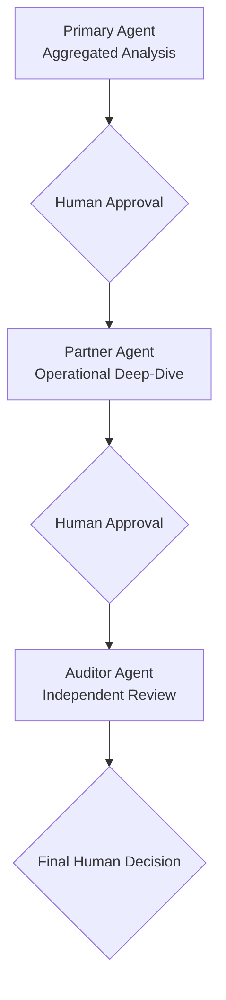

# Architecture Analysis — Agentic Solution for Product Decision Support

## Overview

This repository contains the **architecture analysis** of an AI agent-based solution designed to **support product team decision-making** in the beverage (consumer products) industry.
This is a sample use case to demonstrate MAF (Microsoft Agent Framework 1.0) and A2A implementation using Azure Service Bus as integrator. It also includes an analysis of a future migration to the **native A2A (Agent-to-Agent) protocol** built into MAF, which would replace the Service Bus transport with direct HTTP-based agent communication — see [`sample/FUTURE-A2A.md`](sample/FUTURE-A2A.md) for details.

The solution is **analytical and advisory** — it does not execute operational actions. Its goal is to provide explainable and traceable analyses that assist humans in making decisions about territories, brands, and product packages.

## Core Principles

- **Explainability**: every AI-generated output must be justifiable and traceable.
- **Human-in-the-loop**: humans approve each transition between analytical stages.
- **Data governance**: strict control over data access and usage.
- **Enterprise security**: adherence to corporate security standards.

## Agent Architecture

The solution is composed of **3 agent types**:

### Primary Agent

- Performs **aggregated analyses** on enterprise data from the main organization.
- Identifies **high-impact territories** across brands and product packages.
- Produces explanatory analyses that direct the focus of the Partner Agent.

### Partner Agent

- Performs **operational deep-dives** on partner data, with focus defined by the Primary Agent.
- Identifies **consumption clusters**.
- Each partner is an **independent company** with its own infrastructure and IT staff.
- There is **one specialized agent per partner**, implying a distributed topology.

### Auditor Agent

- Performs **independent review and quality control** over the outputs of the Primary and Partner agents.
- Verifies **analytical consistency**, identifying inconsistencies or failures.
- Acts as an internal validation layer before the final human decision.

## Analytical Flow

## Solution Constraints

- **Analysis only** — no operational actions are executed.
- **Mandatory human approval** between each analytical stage.
- **All outputs are explainable and traceable**.

## Observability

### Must Include

- Logging of user actions (event-level only, no content).
- Logging of agent execution flows and execution identifiers.
- Logging of errors, failures, and timeouts.
- Logging of content moderation and scope-control events.
- System version and technical metadata.
- Basic monitoring: agent availability, execution success rate, recurrent failures, and data source availability.

### Must Not Include (for the Demo)

- No logging of user prompts or AI-generated content.
- No advanced enterprise observability tooling (unless explicitly proposed).
- No real-time review of individual interactions.

## Proposed Architecture

> See the full diagram: [architecture/high-level-architecture.drawio](architecture/high-level-architecture.drawio)

### Technology Stack

| Layer | Azure Service | Purpose |
|---|---|---|
| **Presentation** | Azure Static Web App | Product team interface and human approval UI |
| **API Gateway** | Azure API Management | Single entry point, authentication enforcement, rate limiting |
| **Orchestration** | Python app (FastAPI + uvicorn) + Microsoft Agent Framework (MAF) | Workflow engine managing agent sequencing and HITL checkpoints |
| **Async Messaging** | Azure Service Bus | Cross-boundary communication with partner agents |
| **State Management** | Azure Cosmos DB | Workflow state and approval status persistence |
| **AI Agents** | Azure AI Foundry | Primary Agent and Auditor Agent hosted centrally |
| **Partner Agents** | Partner-owned infrastructure | One agent per partner, deployed in their own environment |
| **Enterprise Data** | Azure SQL Database | Organization's analytical data |
| **Output Storage** | Azure Storage Accounts | Persisted analysis outputs and audit trail |
| **Identity** | Microsoft Entra ID + Managed Identities | Authentication and authorization |
| **Secrets** | Azure Key Vault | Credentials and configuration secrets |
| **Monitoring** | Azure Monitor + Application Insights + Log Analytics | Event-level logging only (no content captured) |

### Orchestration with Microsoft Agent Framework (MAF)

MAF serves as the core multi-agent orchestrator, running as a Python application. It defines how agents are invoked, how they communicate, and how the workflow progresses through HITL (Human-in-the-Loop) checkpoints.

The orchestration flow:

1. **MAF Orchestrator invokes the Primary Agent** (direct call via MAF SDK) — the agent reads enterprise data and produces an aggregated analysis.
2. **Workflow pauses** — state is persisted to Cosmos DB and the Product Team is notified for approval.
3. **On human approval**, the orchestrator **publishes a message to Service Bus** to invoke Partner Agent(s) asynchronously.
4. **Partner Agent(s) execute locally** in their own infrastructure, reading partner data and producing results. Results are published back to Service Bus.
5. **Workflow pauses again** for a second human approval.
6. **On approval**, the orchestrator **invokes the Auditor Agent** (direct call via MAF SDK) for independent review.
7. **Final output is delivered** to the Product Team for decision.

### Cross-Boundary Communication with Partners

Partner Agents live in **completely separate infrastructure** owned by independent companies. The architecture uses **Azure Service Bus** as the cross-boundary bridge:

- The MAF Orchestrator **publishes structured requests** to a Service Bus topic (no raw data crosses the boundary).
- Partner infrastructure **subscribes** to the topic and processes requests locally.
- Results are **published back** to a response queue on Service Bus.
- Partners are **not required to use MAF** — they only need to consume and produce Service Bus messages conforming to a shared contract.

This pattern ensures **data sovereignty** (partner data never leaves partner infrastructure), **loose coupling** (partners can be temporarily offline), and **technology agnosticism** (partners choose their own implementation stack).

### Key Architectural Decisions

1. **Service Bus over REST APIs for partner communication** — async messaging avoids synchronous timeout risks, eliminates the need for partners to expose public endpoints, and handles partner downtime gracefully.
2. **Cosmos DB for workflow state** — enables HITL checkpoints to persist state across human review sessions that may take hours or days.
3. **Auditor Agent independence** — the Auditor Agent runs with a separate context and model configuration to ensure it is not influenced by the Primary or Partner agents.
4. **Event-level only observability** — logging captures execution flows, errors, and metadata without recording prompts or AI-generated content, preserving the content-free constraint.

## Sample Demo

A minimal sample implementation is available under `sample/` to demonstrate the multi-agent orchestration pattern with MAF, Azure Service Bus, and plain Python applications.

- **[Demo Overview](sample/DEMO.md)** — how the demo works, components, execution flow, logging strategy, and production disclaimers.
- **[Demo Setup Guide](sample/DEMO-SETUP.md)** — step-by-step instructions for deploying the required Azure resources, configuring the environment, and running the demo.
