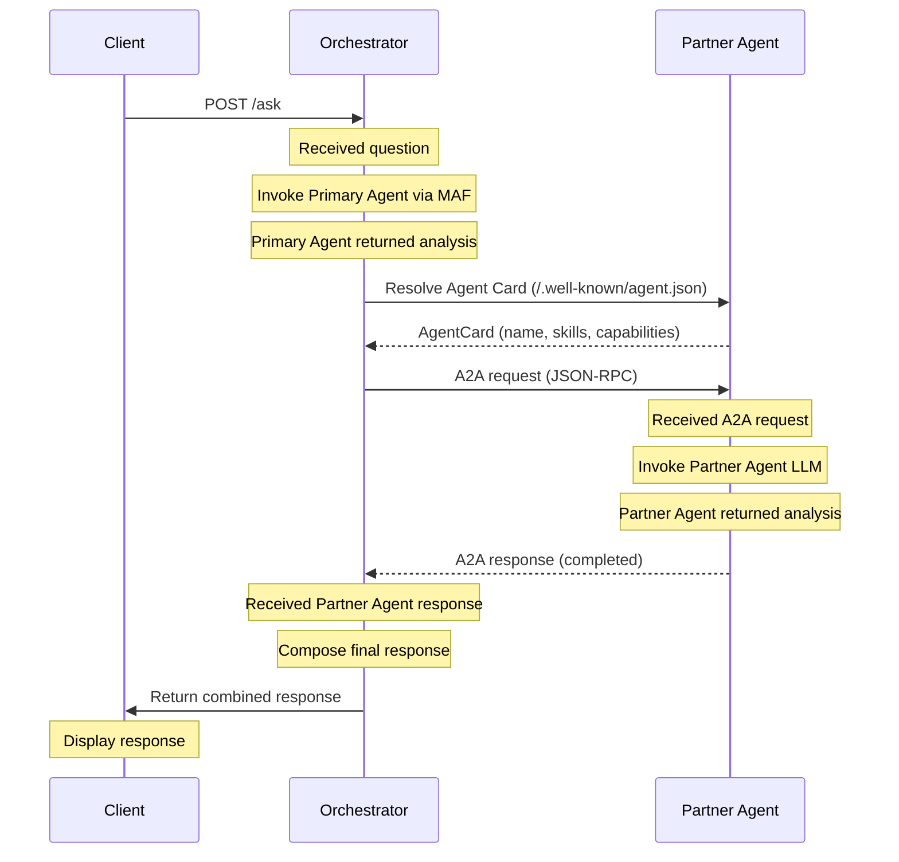

# Sample Demo — Multi-Agent Orchestration with MAF 1.0

> **Author:** Vicente Maciel Junior — vicentem@microsoft.com — Cloud & AI Solutions Architect

This sample demonstrates a **multi-agent orchestration pattern** using [Microsoft Agent Framework (MAF) 1.0](https://learn.microsoft.com/en-us/agent-framework/overview/?pivots=programming-language-python) (GA) and the **A2A (Agent-to-Agent) protocol**. It shows how a locally defined agent and a remote agent can collaborate through direct HTTP-based communication, running as plain Python applications.

> **Disclaimer**: This demo is based on a **fictional beverage company**. All company names, brand names (Velvet Ember, Midnight Drift, Silver Mist, Golden Breeze, Coral Bloom), regions, territories, and data are entirely fictional and do not represent any real company or product.

> **Framework reference**: MAF 1.0 is the GA successor to both [AutoGen](https://github.com/microsoft/autogen) and [Semantic Kernel](https://github.com/microsoft/semantic-kernel). It combines AutoGen’s simple agent abstractions with Semantic Kernel’s enterprise features (session-based state management, type safety, middleware, telemetry) and adds graph-based workflows for explicit multi-agent orchestration.
> **A2A protocol**: The [Agent-to-Agent (A2A)](https://google.github.io/A2A/) protocol is an open standard for inter-agent communication. MAF integrates natively with A2A via the `agent-framework-a2a` (client) and `a2a-sdk` (server) packages. For a comparison with the previous Service Bus approach, see [COMPARISON-SB-VS-A2A.md](COMPARISON-SB-VS-A2A.md).
## Objective

Demonstrate the core pattern of the proposed architecture:

- A **MAF 1.0 orchestrator** coordinating multiple agents.
- A **local agent** (Primary Agent) invoked directly via MAF `Agent` class with `OpenAIChatClient`.
- A **remote agent** (Partner Agent) running as a separate process, exposing an **A2A HTTP endpoint** that the orchestrator discovers and calls directly.
- **Step-by-step logging** to Azure Storage Account for observability.
- **Correlation/Task ID traceability** across all components.

## What This Demo Does NOT Cover

- Human-in-the-loop (HITL) approval gates.
- Auditor Agent.
- Web frontend — uses a CLI client instead.
- Cross-tenant authentication — uses a single subscription with separate resource groups.
- Cosmos DB for state management — uses synchronous flow for simplicity.

## Use-Case Scenario

The demo uses **free-text input** — the user types any question and the agents reason over a comprehensive simulated dataset embedded in their system prompts. There is no scenario selector or routing logic.

### Agent Roles

| Agent | Role | Input | Output |
|---|---|---|---|
| **Primary Agent** | Aggregated territory analysis | User question + simulated enterprise data (embedded in system prompt) | Identifies relevant territories, ranks them by key metrics, and recommends focus areas |
| **Partner Agent** | Operational deep-dive on partner distribution data | Primary Agent's findings and recommendations | Analyzes consumption clusters, retail density, distribution coverage, and demand patterns within the recommended territories |

### Simulated Data

- No real data sources are used. Each agent's system prompt includes a **comprehensive simulated dataset** covering multiple regions, territories, brands, and SKUs.
- Both agents share the same data universe, but each sees it from a different perspective (enterprise aggregation vs. partner operations).
- The "analysis" is the LLM reasoning over the simulated data, producing a structured response.
- The orchestrator combines both analyses into a final consolidated view.

### Suggested Test Questions

The following questions are designed to exercise different analytical patterns. Copy-paste them into the client or adapt freely:

**1. Territory Expansion Analysis**
> Analyze the opportunity for launching a 350ml Velvet Ember can in the Southeast region. Which territories show the highest potential based on current brand performance?

**2. Brand Performance Decline Investigation**
> Midnight Drift has been declining in the Northeast region over the last two quarters. What's driving the drop, and which territories need immediate attention?

**3. Portfolio Optimization**
> We're rationalizing the product portfolio in the Midwest region. Which low-performing SKUs should we consider discontinuing, and what's the risk of losing shelf space?

**4. Seasonal Demand Planning**
> Summer peak is approaching. Based on last year's performance, which territories in the South region need increased distribution capacity for the Velvet Ember 2L package?

## Components

### Client (`sample/client/`)

An interactive Python CLI script that:

1. Generates a correlation ID for the interaction.
2. Prompts the user for a question.
3. Sends the question to the orchestrator via HTTP POST.
4. Displays step-by-step progress.
5. Shows the combined response from both agents.

### Orchestrator (`sample/app-orchestrator/`)

A Python application with FastAPI + uvicorn that:

1. Creates MAF `Agent` instances using `OpenAIChatClient` with Azure routing (`azure_endpoint` + `DefaultAzureCredential`).
2. Receives the user question from the client via `POST /api/ask`.
3. Invokes the Primary Agent locally via `agent.run()`.
4. Discovers the Partner Agent by resolving its **A2A Agent Card** at `/.well-known/agent.json`.
5. Calls the Partner Agent via the **A2A protocol** using `A2AAgent.run()`.
6. Composes the final response combining both agents' outputs.
7. Returns the response to the client.

### Partner Agent (`sample/app-partner-agent/`)

A Python application hosting an **A2A HTTP server** (Starlette + uvicorn) that:

1. Publishes an **Agent Card** at `/.well-known/agent.json` for service discovery.
2. Receives requests via the **A2A JSON-RPC protocol**.
3. Creates a MAF `Agent` using `OpenAIChatClient` with Azure routing and invokes it via `agent.run()`.
4. Returns the analysis result through the A2A response protocol.

## Execution Flow



## Logging Strategy

### Console Output (Client)

The client displays real-time progress on the terminal:

```
[14:32:00] Starting orchestrator client...
[14:32:00] Correlation ID: abc123
[14:32:00] > Enter your question: What are the top impact territories for brand X?
[14:32:01] Sending question to orchestrator...
[14:32:01] Waiting for response...
[14:32:03] Response received from orchestrator:
           ── Primary Agent Analysis ──
           [analysis text]
           ── Partner Agent Analysis ──
           [analysis text]
[14:32:03] Done.
```

### Log Files (Storage Account)

Each component writes a log file to Azure Storage Account per execution:

- `logs/{correlation-id}-orchestrator.log`
- `logs/{correlation-id}-partner-agent.log`

Every entry follows the format: `[timestamp] [correlation-id] message`

**Important**: Log files record **events and metadata only** — no prompts or AI-generated content is logged. This mirrors the production observability constraint.

## Folder Structure

```
sample/
├── client/
│   ├── main.py
│   └── pyproject.toml
├── app-orchestrator/
│   ├── main.py
│   └── pyproject.toml
├── app-partner-agent/
│   ├── main.py
│   └── pyproject.toml
└── .env
```

## Production Disclaimers

This demo makes simplifications that **should not** be carried into production. Key differences:

| Demo Approach | Production Approach |
|---|---|
| Plain Python apps (FastAPI + uvicorn) | Container Apps, App Service, or Functions with proper CI/CD |
| Direct A2A HTTP calls (localhost) | A2A over TLS with mutual authentication, or durable messaging (Service Bus) for offline partners |
| Single Azure subscription, two resource groups | Separate tenants/subscriptions per organization |
| No HITL approval gates | Mandatory human approval between analytical stages |
| No Auditor Agent | Independent audit agent reviews all outputs |
| `agent-framework-a2a` preview package | GA release with enterprise support |

## MAF 1.0 — Key References

| Resource | Link |
|---|---|
| Overview | https://learn.microsoft.com/en-us/agent-framework/overview/?pivots=programming-language-python |
| Agents & Providers | https://learn.microsoft.com/en-us/agent-framework/agents/providers/?pivots=programming-language-python |
| Azure OpenAI Provider (Python) | https://learn.microsoft.com/en-us/agent-framework/agents/providers/openai?pivots=programming-language-python |
| Workflows | https://learn.microsoft.com/en-us/agent-framework/workflows/?pivots=programming-language-python |
| Integrations (A2A, Azure Functions) | https://learn.microsoft.com/en-us/agent-framework/integrations/?pivots=programming-language-python |
| Python package: `agent-framework` | `uv add agent-framework` |
| Python package: `agent-framework-openai` | `uv add agent-framework-openai` |
| Python package: `agent-framework-a2a` (preview) | `uv add agent-framework-a2a --prerelease allow` |
| Python package: `a2a-sdk` | `uv add a2a-sdk` |
| A2A Protocol Specification | https://google.github.io/A2A/ |
| Python package: `agent-framework-a2a` (preview) | `uv add agent-framework-a2a --prerelease allow` |
| Python package: `a2a-sdk` | `uv add a2a-sdk` |
| A2A Protocol Specification | https://google.github.io/A2A/ |
